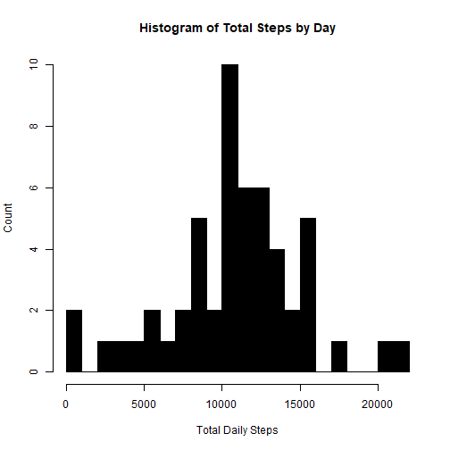
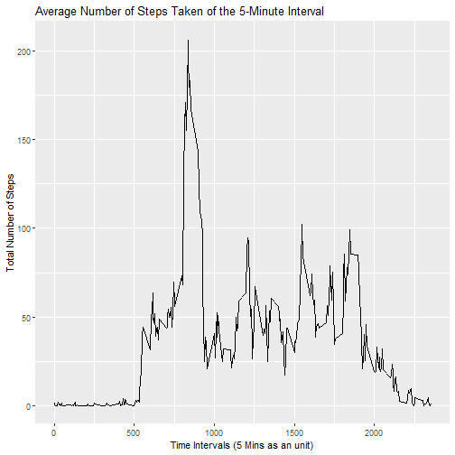
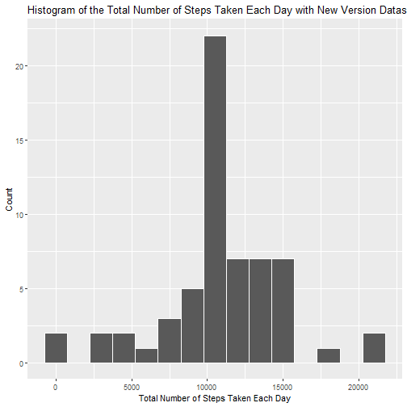
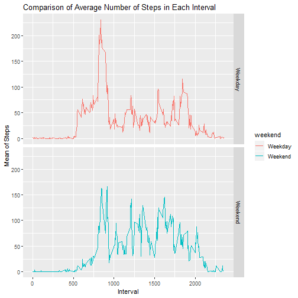

## 1. Load the data

```r
# Setting the working directory
setwd("C:/Users/pnave/Documents/Coursera/Course5/Week2/Assignment")
library(magrittr)
library(dplyr)
```

```
## 
## Attaching package: 'dplyr'
```

```
## The following objects are masked from 'package:stats':
## 
##     filter, lag
```

```
## The following objects are masked from 'package:base':
## 
##     intersect, setdiff, setequal, union
```

```r
library(ggplot2)

if(!file.exists('activity.csv'))
  {
    unzip('repdata_data_activity.zip')
  }

#Loading and preprocessing the data
BaseActivityData <- read.csv("activity.csv", header = TRUE)
head(BaseActivityData,10)
```

```
##    steps       date interval
## 1     NA 2012-10-01        0
## 2     NA 2012-10-01        5
## 3     NA 2012-10-01       10
## 4     NA 2012-10-01       15
## 5     NA 2012-10-01       20
## 6     NA 2012-10-01       25
## 7     NA 2012-10-01       30
## 8     NA 2012-10-01       35
## 9     NA 2012-10-01       40
## 10    NA 2012-10-01       45
```
## 2. Process/transform the data into a format suitable for analysis

### Prepaing the data to ignore NA

```r
databyday <- BaseActivityData %>% select(date, steps) %>% group_by(date) %>% summarize(tsteps= sum(steps)) %>%na.omit()
```
## What is mean total number of steps taken per day?
### 1. Calculate the total number of steps taken per day

```r
head(databyday,10)
```

```
## # A tibble: 10 x 2
##    date       tsteps
##    <fct>       <int>
##  1 2012-10-02    126
##  2 2012-10-03  11352
##  3 2012-10-04  12116
##  4 2012-10-05  13294
##  5 2012-10-06  15420
##  6 2012-10-07  11015
##  7 2012-10-09  12811
##  8 2012-10-10   9900
##  9 2012-10-11  10304
## 10 2012-10-12  17382
```

### 2. Plot of the Total Steps by day

```r
hist1 <- hist(databyday$tsteps, xlab = "Total Daily Steps",ylab = "Count" ,main="Histogram of Total Steps by Day", col="black", breaks = 20)
```



```r
print(hist1)
```

```
## $breaks
##  [1]     0  1000  2000  3000  4000  5000  6000  7000  8000  9000 10000
## [12] 11000 12000 13000 14000 15000 16000 17000 18000 19000 20000 21000
## [23] 22000
## 
## $counts
##  [1]  2  0  1  1  1  2  1  2  5  2 10  6  6  4  2  5  0  1  0  0  1  1
## 
## $density
##  [1] 3.773585e-05 0.000000e+00 1.886792e-05 1.886792e-05 1.886792e-05
##  [6] 3.773585e-05 1.886792e-05 3.773585e-05 9.433962e-05 3.773585e-05
## [11] 1.886792e-04 1.132075e-04 1.132075e-04 7.547170e-05 3.773585e-05
## [16] 9.433962e-05 0.000000e+00 1.886792e-05 0.000000e+00 0.000000e+00
## [21] 1.886792e-05 1.886792e-05
## 
## $mids
##  [1]   500  1500  2500  3500  4500  5500  6500  7500  8500  9500 10500
## [12] 11500 12500 13500 14500 15500 16500 17500 18500 19500 20500 21500
## 
## $xname
## [1] "databyday$tsteps"
## 
## $equidist
## [1] TRUE
## 
## attr(,"class")
## [1] "histogram"
```
### 3.Calculate and report the mean and median of the total number of steps taken per day

```r
## Mean number of Steps
mean(databyday$tsteps)
```

```
## [1] 10766.19
```

### Median number of steps

```r
median(databyday$tsteps)
```

```
## [1] 10765
```
## What is the average daily activity pattern?

### 1.Summarizing the data to intervals and steps

```r
databyinterval <- BaseActivityData%>% select(interval, steps) %>% na.omit() %>% group_by(interval) %>% summarize(tsteps= mean(steps)) 

TimeSeries1 <- ggplot(data=databyinterval, mapping = aes(x=interval, y=tsteps))+ geom_line()  +
    xlab("Time Intervals (5 Mins as an unit)") + 
    ylab("Total Number of Steps") +
    ggtitle("Average Number of Steps Taken of the 5-Minute Interval")

print(TimeSeries1)
```



### 2.Which 5-minute interval, on average across all the days in the dataset, contains the maximum number of steps?

```r
databyinterval[which(databyinterval$tsteps== max(databyinterval$tsteps)),]
```

```
## # A tibble: 1 x 2
##   interval tsteps
##      <int>  <dbl>
## 1      835   206.
```
## Imputing missing values
### Note that there are a number of days/intervals where there are missing values (coded as NA\color{red}{\verb|NA|}NA). The presence of missing days may introduce bias into some calculations or summaries of the data.

### 1.Calculate and report the total number of missing values in the dataset (i.e. the total number of rows with NA\color{red}{\verb|NA|}NAs)

```r
missingVals <- sum(is.na(data))
```

```
## Warning in is.na(data): is.na() applied to non-(list or vector) of type
## 'closure'
```
### 2.Devise a strategy for filling in all of the missing values in the dataset. The strategy does not need to be sophisticated. I will use the mean for that 5-minute interval to replace all the missing values in the dataset. At the end, I will check if all the NAs got replaced.

```r
replacewithmean <- function(x) replace(x, is.na(x), mean(x, na.rm = TRUE))
```
### 3. Create a new dataset that is equal to the original dataset but with the missing data filled in

```r
newmeandataset <- BaseActivityData%>% group_by(interval) %>% mutate(steps= replacewithmean(steps))
```

```
## Warning: package 'bindrcpp' was built under R version 3.4.4
```

```r
head(newmeandataset)
```

```
## # A tibble: 6 x 3
## # Groups:   interval [6]
##    steps date       interval
##    <dbl> <fct>         <int>
## 1 1.72   2012-10-01        0
## 2 0.340  2012-10-01        5
## 3 0.132  2012-10-01       10
## 4 0.151  2012-10-01       15
## 5 0.0755 2012-10-01       20
## 6 2.09   2012-10-01       25
```
### 4.Make a histogram of the total number of steps taken each day and Calculate and report the mean and median total number of steps taken per day. Do these values differ from the estimates from the first part of the assignment? What is the impact of imputing missing data on the estimates of the total daily number of steps?

#### New Total number of steps taken each day 

```r
TotSummedDataByDay <- aggregate(newmeandataset$steps, by=list(newmeandataset$date), FUN = sum)
 
names(TotSummedDataByDay)[names(TotSummedDataByDay) == "x"] <- "Total"
names(TotSummedDataByDay)[names(TotSummedDataByDay) == "Group.1"] <- "Date"
as.Date(TotSummedDataByDay$Date,"%Y-%m-%d")
```

```
##  [1] "2012-10-01" "2012-10-02" "2012-10-03" "2012-10-04" "2012-10-05"
##  [6] "2012-10-06" "2012-10-07" "2012-10-08" "2012-10-09" "2012-10-10"
## [11] "2012-10-11" "2012-10-12" "2012-10-13" "2012-10-14" "2012-10-15"
## [16] "2012-10-16" "2012-10-17" "2012-10-18" "2012-10-19" "2012-10-20"
## [21] "2012-10-21" "2012-10-22" "2012-10-23" "2012-10-24" "2012-10-25"
## [26] "2012-10-26" "2012-10-27" "2012-10-28" "2012-10-29" "2012-10-30"
## [31] "2012-10-31" "2012-11-01" "2012-11-02" "2012-11-03" "2012-11-04"
## [36] "2012-11-05" "2012-11-06" "2012-11-07" "2012-11-08" "2012-11-09"
## [41] "2012-11-10" "2012-11-11" "2012-11-12" "2012-11-13" "2012-11-14"
## [46] "2012-11-15" "2012-11-16" "2012-11-17" "2012-11-18" "2012-11-19"
## [51] "2012-11-20" "2012-11-21" "2012-11-22" "2012-11-23" "2012-11-24"
## [56] "2012-11-25" "2012-11-26" "2012-11-27" "2012-11-28" "2012-11-29"
## [61] "2012-11-30"
```

```r
head(TotSummedDataByDay,10)
```

```
##          Date    Total
## 1  2012-10-01 10766.19
## 2  2012-10-02   126.00
## 3  2012-10-03 11352.00
## 4  2012-10-04 12116.00
## 5  2012-10-05 13294.00
## 6  2012-10-06 15420.00
## 7  2012-10-07 11015.00
## 8  2012-10-08 10766.19
## 9  2012-10-09 12811.00
## 10 2012-10-10  9900.00
```

#### Summary of new data

```r
 summary(TotSummedDataByDay)
```

```
##          Date        Total      
##  2012-10-01: 1   Min.   :   41  
##  2012-10-02: 1   1st Qu.: 9819  
##  2012-10-03: 1   Median :10766  
##  2012-10-04: 1   Mean   :10766  
##  2012-10-05: 1   3rd Qu.:12811  
##  2012-10-06: 1   Max.   :21194  
##  (Other)   :55
```
  
####  Make a histogram of the total number of steps taken each day

```r
hist2 <- ggplot(data = TotSummedDataByDay, aes(Total)) + 
    geom_histogram(binwidth = 1500, colour = "white") +
    xlab("Total Number of Steps Taken Each Day") +
    ylab("Count") +
    ggtitle("Histogram of the Total Number of Steps Taken Each Day with New Version Dataset")
print(hist2)
```


#### Compare the mean and median of Old and New data

```r
oldmean <- mean(databyday$tsteps, na.rm = TRUE)
newmean <- mean(TotSummedDataByDay$Total)
oldmedian <- median(databyday$tsteps, na.rm = TRUE)
newmedian <- median(TotSummedDataByDay$Total)

paste("OldMean was: ",oldmean, "NewMean is:", newmean)
```

```
## [1] "OldMean was:  10766.1886792453 NewMean is: 10766.1886792453"
```

```r
paste("OldMedian was: ",oldmedian, "NewMedian is:", newmedian)
```

```
## [1] "OldMedian was:  10765 NewMedian is: 10766.1886792453"
```
##  Are there differences in activity patterns between weekdays and weekends?

### 1.Create a new factor variable in the dataset with two levels – “weekday” and “weekend” indicating whether a given date is a weekday or weekend day.

```r
newmeandataset$date <- as.Date(newmeandataset$date,"%Y-%m-%d")
newmeandataset$weekday <- weekdays(newmeandataset$date)
newmeandataset$weekend <- ifelse(newmeandataset$weekday=="Saturday" | newmeandataset$weekday=="Sunday", "Weekend", "Weekday" )

## Compute the steps
meandataweekendweekday <- aggregate(newmeandataset$steps , by= list(newmeandataset$weekend, newmeandataset$interval), na.omit(mean))
names(meandataweekendweekday) <- c("weekend", "interval", "steps")
```

### 2. Make a panel plot containing a time series plot (i.e. type = "l") of the 5-minute interval (x-axis) and the average number of steps taken, averaged across all weekday days or weekend days (y-axis). See the README file in the GitHub repository to see an example of what this plot should look like using simulated data.

```r
head(meandataweekendweekday)
```

```
##   weekend interval      steps
## 1 Weekday        0 2.25115304
## 2 Weekend        0 0.21462264
## 3 Weekday        5 0.44528302
## 4 Weekend        5 0.04245283
## 5 Weekday       10 0.17316562
## 6 Weekend       10 0.01650943
```

```r
hist3 <- ggplot(meandataweekendweekday, aes(x=interval, y=steps, color=weekend)) + geom_line()+
facet_grid(weekend ~.) + xlab("Interval") + ylab("Mean of Steps") +
    ggtitle("Comparison of Average Number of Steps in Each Interval")

print(hist3)
```


#### End of Assignment and Code


    


 
